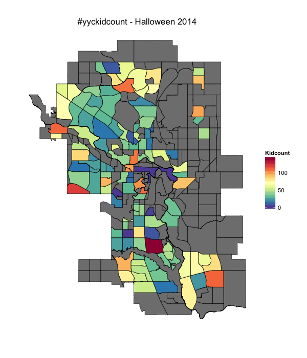

#yyckidcount - Halloween 2014
===========

There was some great twitter activity last night reporting number of trick-or-treaters using the hashtag #yyckidcount. 

I took the data from Twitter's API, and using the R language, pulled this data together by taking the latest tween from each user that mentioned a community name with a single number (tweets with multiple numbers are excluded to avoid things like: "Have had 9 kids since 6." , but this could easily be extended).

From there, I took the median value for all tweets within each community.

It's far from perfect, but here's the result:

